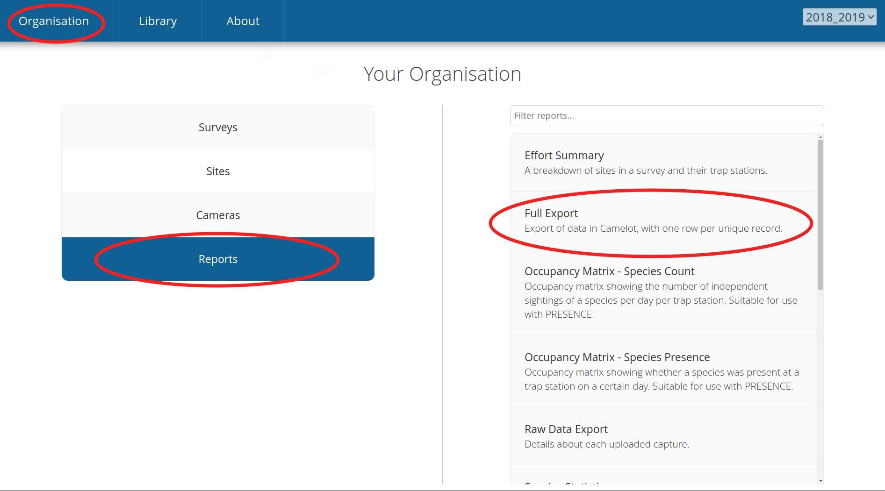
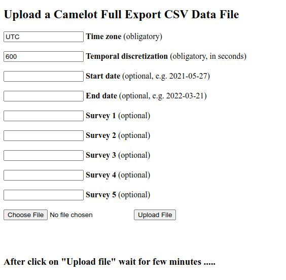

 

 

# **Camelot RReport Documentation**

### [Camelot RReport web application](https://shiny.vef.hr/){target="_blank"}

 

#### **Introduction**

Camera traps have emerged as indispensable tools for studying wildlife in their natural environments. By employing motion-sensing technology, camera traps capture images and videos of various species, offering researchers to record their presence, activity patterns or behaviour. Through the analysis of these data, scientists can gain deeper insights into species abundance, habitat preferences, and their interactions. Moreover, camera trapping enables the monitoring of elusive or endangered species, helping in the development of targeted conservation strategies. However, camera trapping can generate extensive datasets, which require efficient softwares for data management to enable further analyses.

 

#### **About Camelot**

Camelot is an open-source camera trapping software ([camelotproject.org](https://camelotproject.org/){target="_blank"}), for wildlife researchers and conservationists. Camelot enables efficient classification of camera trap photos, keeping track of camera traps activity and positioning in the field, and management of recorded species data. Camelot also has the possibility of creating reports (exports in .cvs format), allowing users to efficiently extract structured data. However, its functionality falls short in terms of comprehensive data analysis reporting. While Camelot does offer some calculated columns, its reporting features are limited, providing only sparse analytical insights compared to more advanced data analysis tools. Users then need to integrate Camelot's data exports with other reporting solutions for a more thorough analysis of extracted data.

 

#### **About RReport**

[RReport](https://shiny.vef.hr/ "RReport server"){target="_blank"} is a open-source web application designed to integrate with Camelot, using Camelot's data exports to generate more advanced analyses. Powered by a customized R script it incorporates packages XY, while the R package Shiny visualises the results. RReport enhances data insights and visualization capabilities beyond Camelot's native functionalities.

 

## **How to use**

To use RReport, you require a Camelot „Full export“ report, which can be generated and exported via the "Reports" section within Camelot.

 

## **1. Login**

To access the RRreport you need to define and type in a login username by choice that will be linked to your data. Login username must not contain space, separators or uncommon letters. By logging in, theapplication creates a unique folder under this username which will be used for storing uploded data, and created reports,tables and graphs.Users can delete this folder or it will be automatically deleted in 7 days after the last access.

Each username can be linked with only one data upload. In case you want to create a new report with a new dataset, a different login username must be entered (you can use the same username following a number without space, e.g. username, username1, username2, etc.)

If you type in an existing username – it skips the upload interface and jumps directly to the report's Results.

 

## **2. File upload**

The interface for uploading data consists of the:

-   **Time zone** (default UTC ): choose the TM, [list of TZ](https://en.wikipedia.org/wiki/List_of_tz_database_time_zones "List of time zone"){target="_blank"}

-   **Temporal discretization** (default 600 seconds): used to discretise „events“ - the period of time between independent triggers (Camelot manual, section Reports – Independent Observations, p. 31 ) of distinct individuals. Although the optimal independence interval has never been empirically estimated from camera traps, it typically ranges from 10 to 60 min (although 1–5 min has been used for small mammals), and the researcher should report on the criteria used to set the interval. However, for some analyses such as occupancy modelling, capture-recapture analyses, or movement patterns, the interval can be one or even multiple days (Reference ).

-   **Start date**: starting date for data analysis

-   **End date**: end date for data analysis

-   **Survey 1 – 5**: A survey in Camelot represents a research project and will contain details about your camera traps and uploaded images. Camelot allows for creation of multiple surveys which are all included in the Camelot Full export file. If you want to omit data from a certain survey from the analysis, enter in optional boxes the names of surveys that you want to include. If you want to use data from all surveys you can leave the area empty.

-   **Choose file**: choose the downloaded Camelot Full export from your computer

 

## **3. Results**

 

#### **TAB 1. Original data**

-   Raw upload of the Full export CSV file from Camelot

 

#### **TAB 2. Trap Stations: (ovdje su datumi od kada je pojedini interval TrapStationa bio aktivan, nije odrezano vremenski točno kako je u filteru) - objasniti**

-   2.1. Map – visualisation of Trap Station locations – downloadable as a GPKG file for GIS

-   2.2. Trap Station interval – interval within which a camera trap was continuously active in the field (ne ovisi o filteru) ako session interval upada unutar vremenskog filtera onda uključuje cijeli session - samo kod prikaza aktivnosti kamera)

-   2.3. Trap Station activity per month – sum of active days per trap station followed by the number of active days per trap station per month

-   2.4. Trap station activity per month SUM – sum of the table under 2.3 - used for calculating “Species list and count”

 

#### **TAB 3. Events / Species**

-   3.1. Species list and counts -

Total_q_per_30_days = absolute number of CT days per month (na svim kamerama se pojavilo 0.XY vuka u 30 dana) = prosječna pojavnost vrste po kameri mjesečno

-   3.2. Temporal discretization data - glavna tablica filtrirana po vremenu i vrstama (diskretizacija) - događaji

0.25 svitanje, 0.5 sredina dana, 0.00 & 1.00 sredina noći

Dodati definiciju noći i dana prema suncu (dusk and dawn)

Na temelju toga je napravljen graf - Graph daily activity

\- treba objasniti diskretizaciju, napisati da su sve životinje kojima nije determinirana dob da su proglašene odrasle životinje, da spol ne uzima u obzir jer se kod većine slika ne može utvrditi spol životinje, tj. ovisno o vrsti životinje uvijek se daje prednost jednom spolu

-   3.3 Aggregation events_full - isto kao ova gornja samo su u tablici sve kolone iz full exporta (original data discretisized)

 

#### **TAB 4. Abundance change / Activity**

-   4.1. Graph species activity per years

-   4.2. Graph species activity per sum months

-   4.3. Graph species activity per months / year

-   4.4. Graph daily activity

-   4.5. Species activity per years

-   4.6. Species activity per sum months

-   4.7. Species activity per months / years

 

 

Citate: Gomerčić, T., I. Topličanec, M. Sindičić, V. Šimunović (2024): ........

GitHub: <https://github.com/Gomercic/Camelot_RReport>

Contact: tomislav.gomercic\@vef.unizg.hr

University of Zagreb, Faculty of Veterinary Medicine, Zagreb, Croatia
